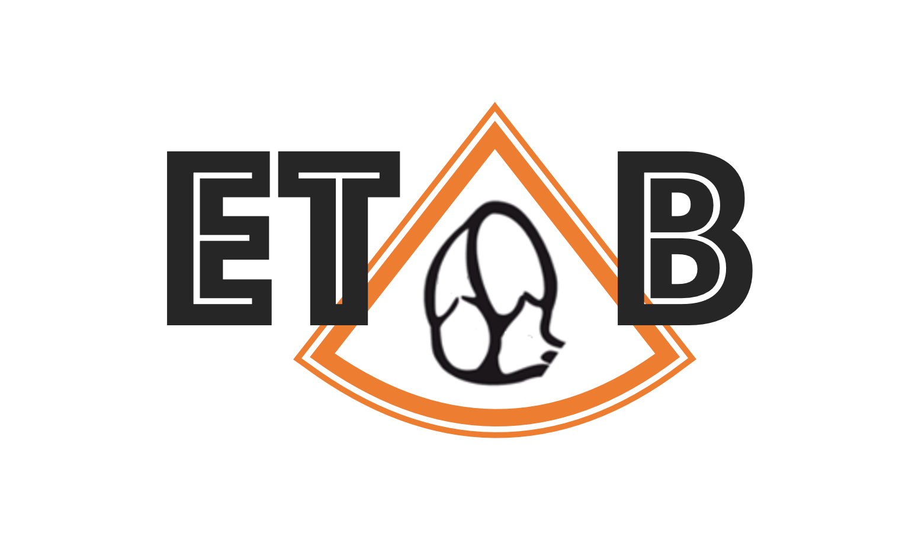
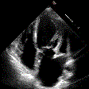
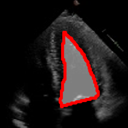
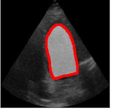
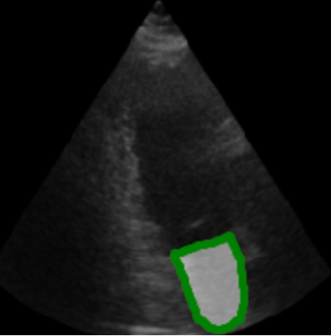
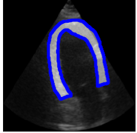

<p align="center">
  
</p>
<h3 align="center">
    <b> ETAB: A Benchmark Suite for Visual Representation Learning in Echocardiography </b>
</h3>

---------------

<p align="center">
  <a href="#-Overview">What is ETAB?</a> •
  <a href="#-Getting-Started">Getting Started</a> •
  <a href="#-Documentation">Documentation</a> •
  <a href="#Documentation">Community</a> •
  <a href="https://github.com/ahmedmalaa/ETAB/blob/main/docs/leaderboard.md#how-to-contribute">Contributing</a> •
  <a href="https://openreview.net/pdf?id=b0VDQiNLPy9">Paper</a> 
</p>

---------------

[](https://www.python.org/)
[](https://pytorch.org/)

The echocardiographic task adaptation benchmark (ETAB) library contains a suite of standardized benchmarks that can be used to evaluate visual representations of cardiac ultrasound (echocardiogram) data with respect to various clinically-relevant tasks using publicly accessible data sets. The ETAB library provides an easy-to-use API for loading various echocardiographic data sets and implementing new algorithms, a unified evaluation protocol for echocardiographic representations and a set of pre-trained models for echocardiograms.

<p align="center">
     
    
    
    
    
</p>

---------------
## 🫀 Overview

Echocardiography is one of the most commonly used non-invasive imaging techniques for assessing cardiac function, examining heart anatomy and diagnosing cardiovascular diseases. An echo study is an ultrasound of the heart acquired by a cardiac sonographer through a transducer device—different acquisition angles by which the device is placed relative to the patient's heart provide different *views* of the heart anatomy. Echocardiograms inform cardiologists, surgeons, oncologists and emergency physicians on clinical decisions pertaining to treatment management and surgical planning. Because of the central role it plays in cardiovascular medicine, there has been a significant interest in applying deep learning-based computer vision models to echocardiograms, with the ultimate goal of automating cardiac evaluation, reducing variance and improving reproducibility in interpreting echocardiograms, and predicting patient-specific clinical outcomes.

The ETAB library comprises a comprehensive suite of visual task adaptation benchmarks tailored to echocardiography data. Each benchmark comprises a source task and a target task; the source-target pair within each benchmark are meant to assess the ability of different representation pre-training approaches to transfer information across data sets, echo views and annotations. These adaptation benchmarks are all conducted on publicly accessible data sets, hence they can be easily used to evaluate existing and future methods. Moreover, using our suite of target tasks we specify a unified evaluation protocol for readily available pre-trained representations which is meant to evaluate the extent by which a given representation generalizes to different tasks, views and patient cohorts. The ETAB benchmark enables researchers to share a unified and publicly-accessible evaluation protocol, even when the representations themselves are pre-trained on private hospital data.

---------------

## 🏃 Getting Started

#### Step 1: Install the ETAB package
Installation from source (recommended)
```python
$git clone https://github.com/ahmedmalaa/ETAB.git
$cd ETAB
$pip install -r requirements.txt
```

Simple installation from PyPI (experimental)
```python
$pip install etab
```

#### Step 2: Download the datasets

The current version of ETAB supports three echocardiography datasets. Details of all datasets can be found in [Section 1](
https://github.com/ahmedmalaa/ETAB/blob/main/docs/data_access.md#datasets) of the documentation below. Please note that ETAB provides a standardized API for loading and processing all datasets, but it does not alter, redistribute or directly share the datasets. To download the data, please follow the [instructions](https://github.com/ahmedmalaa/ETAB/blob/main/docs/data_access.md#downloading-the-datasets) in [Section 1](
https://github.com/ahmedmalaa/ETAB/blob/main/docs/data_access.md) of the documentation below.


---------------

## 📚 Documentation

#### [Section 1: Datasets, Accessibility and Data Processing Tools](docs/data_access.md)

<details>
  <summary><b>Explore Content</b> (click to expand)</summary>
  &nbsp;
  <ul>
    <li><a href="docs/data_access.md#Datasets">Overview of the Supported Echocardiography Datasets</a></li>
    &nbsp;
    <li><a href="docs/data_access.md#Instructions-for-dataset-access">Instructions for Dataset Access</a></li> 
    &nbsp;
    <li><a href="docs/data_access.md#data-loaders-and-processing-tools-demo-notebook">Data Loaders and Processing Tools</a></li> 
    &nbsp;
    <li><a href="https://github.com/ahmedmalaa/ETAB/blob/main/notebooks/Demo%201%20-%20ETAB%20Data%20Loading%20and%20Processing%20Tools.ipynb">Demo Notebook</a></li>
  </ul>

</details>

#### [Section 2: ETAB Benchmark Suite and Model Zoo](docs/benchmark_tasks.md)

<details>
  <summary><b>Explore Content</b> (click to expand)</summary>
  &nbsp;
  <ul>
    <li><a href="docs/benchmark_tasks.md#benchmark-task-categorization-and-encoding">Benchmark Task Categorization and Encoding</a></li> 
    &nbsp;
    <li><a href="docs/benchmark_tasks.md#etab-model-zoo">ETAB Model Zoo</a></li>
    &nbsp;
    <li><a href="docs/benchmark_tasks.md#running-a-benchmark-experiment-out-of-the-box-demo-notebook">Running a Benchmark Experiment Out-of-the-Box</a></li>
    &nbsp;
    <li><a href="https://github.com/ahmedmalaa/ETAB/blob/main/notebooks/Demo%202%20-%20ETAB%20Benchmark%20Tasks.ipynb">Demo Notebooks</a></li>
  </ul>

</details>

#### [Section 3: The ETAB Evaluation Protocol](docs/etab_protocol.md)

<details>
  <summary><b>Explore Content</b> (click to expand)</summary>
  &nbsp;
  <ul>
    <li><a href="docs/etab_protocol.md#Description-of-the-Evaluation-Protocol">Description of the Evaluation Protocol</a></li> 
    &nbsp;
    <li><a href="docs/etab_protocol.md#computing-the-etab-score">Computing the ETAB Score</a></li>
    &nbsp;
    <li>Demo Notebooks</li>
  </ul>

</details>

#### [Section 4: Leaderboard and Benchmark Results](docs/leaderboard.md)

<details>
  <summary><b>Explore Content</b> (click to expand)</summary>
  &nbsp;
  <ul>
    <li><a href="docs/leaderboard.md#etab-leaderboard">ETAB Leaderboard</a></li> 
    &nbsp;
    <li><a href="docs/leaderboard.md#how-to-contribute">How to contribute?</a></li>
  </ul>

</details>

#### [Section 5: Reproducibility Checklist](documentation/leaderboard.md)

---------------
