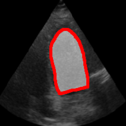
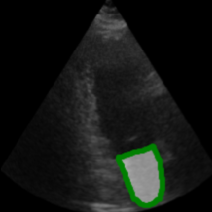
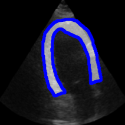

<p align="center">
  
</p>
<h3 align="center">
    <b> ETAB: A Benchmark Suite for Visual Representation Learning in Echocardiography </b>
</h3>

---------------

<p align="center"> 
  <a href="#-what-is-etab">What is ETAB?</a> •
  <a href="#-Getting-Started">Getting Started</a> •
  <a href="#%EF%B8%8F-using-etab">Using ETAB</a> •
  <a href="#-Documentation">Documentation</a> •
  <a href="https://github.com/ahmedmalaa/ETAB/blob/main/docs/leaderboard.md#how-to-contribute">Contributing</a> •
  <a href="#-Community">Community</a> •
  <a href="https://openreview.net/pdf?id=b0VDQiNLPy9">Paper</a> 
</p>

---------------

[](https://www.python.org/)
[](https://pytorch.org/)

Echocardiography is one of the most commonly used non-invasive imaging techniques for assessing cardiac function, examining heart anatomy and diagnosing cardiovascular diseases. An echo study is an ultrasound of the heart acquired by a cardiac sonographer through a transducer device. Different acquisition angles by which the device is placed relative to the patient's heart provide different *views* of the heart anatomy. Echocardiograms inform cardiologists, surgeons, oncologists and emergency physicians on clinical decisions pertaining to treatment management and surgical planning. Because of the central role it plays in cardiovascular medicine, there has been a significant interest in applying deep learning-based computer vision models to echocardiograms, with the ultimate goal of automating cardiac evaluation, reducing variance and improving reproducibility in interpreting echocardiograms, and predicting patient-specific clinical outcomes.

<p align="center">
     
    
    
    
    
</p>

---------------
## 🫀 What is ETAB?

The echocardiographic task adaptation benchmark (ETAB) is a software library that provides a unified and easy-to-use API for developing and testing visual representation learning algorithms across a diverse set of echocardiohraphic tasks of interest using various publicly accessible datasets. ETAB offers:
- A unified API for loading and processing various publicly-accessible echocardiography datasets.
- A comprehensive suite of (transfer learning and downstream) benchmark tasks tailored to echocardiography.
- An easy-to-use API for creating modeling pipelines that supports a wide variety of backbone architectures and covers different types of downstream tasks of interest.
- A unified evaluation protocol for pre-trained echocardiographic representations.

The ETAB library is meant to provide a self-sufficient framework for developing and evaluating visual representations of echocardiograms by creating a metadataset that encapsulates various publicly-accessible data sources. You can use ETAB in your research to develop new models for echocardiography or evaluate pre-trained representations derived from external data sources.

---------------

## 🏃 Getting Started

#### Step 1: Install the ETAB package
Installation from source (recommended)
```python
$git clone https://github.com/ahmedmalaa/ETAB.git 
$pip install -r <path-to-repo>/ETAB/requirements.txt
```

Simple installation from PyPI (experimental)
```python
$pip install etab
```

#### Step 2: Download the datasets

The current version of ETAB supports three echocardiography datasets. Details of all datasets can be found in [Section 1](
https://github.com/ahmedmalaa/ETAB/blob/main/docs/data_access.md#datasets) of the documentation below. Please note that ETAB provides a standardized API for loading and processing data from different sources, but it does not alter, redistribute or directly share the datasets. To download the data, please follow the [instructions](https://github.com/ahmedmalaa/ETAB/blob/main/docs/data_access.md#downloading-the-datasets) in [Section 1](
https://github.com/ahmedmalaa/ETAB/blob/main/docs/data_access.md) of the documentation below.

---------------

## 🛠️ Using ETAB

You can run any benchmark task supported by ETAB using the following CLI

```python
$ python run_benchmark.py --task <str: Task Code> --backbone <str: Backbone representation> \
                          --head <str: Task-specific head> \ 
                          --freeze_backbone <bool: Fully finetune?> \
                          --train_frac <int: fraction of data used for training> \
                          --val_frac <int: fraction of data used for validation> \
                          --lr <float: learning rate> --epochs <int: number of epochs> --batch <int: batch size> 
```
The task encoding convention and the ETAB model zoo are described in detail in [Section 2](https://github.com/ahmedmalaa/ETAB/blob/main/docs/benchmark_tasks.md) of the documentation.

You can also write your own customized program using the ETAB API. A simple example for a customized program is one that evaluates the quality of a pre-trained representation with respect to the echocardiographic tasks by computing the ETAB score. In the following program, we compute the ETAB score for the ResNet-50 backbone pre-trained on ImageNet-1K.

```python
from etab.scores import ETABscore
from torchvision.models import resnet50
                   
backbone    = resnet50(weights="IMAGENET1K_V1")

etab_score  = ETABscore(backbone_architecture="ResNet-50", backbone_model=backbone)
```
The ETAB library provides a succint API for echocardiographic datasets, models, and benchmark tasks that enables writing more sophisticated programs within your research project. Details of the ETAB API along with usage examples and demo notebooks are provided in the documentation below. 

---------------

## 📚 Documentation

To start using the ETAB library in your research, visit the documentation sections below to learn more about its different features and use cases through step-by-step instructions and demo notebooks.

#### [Section 1: Datasets, Accessibility and Data Processing Tools](docs/data_access.md)

<details>
  <summary><b>Explore Content</b> (click to expand)</summary>
  &nbsp;
  <ul>
    <li><a href="docs/data_access.md#Datasets">Overview of the Supported Echocardiography Datasets</a></li>
    &nbsp;
    <li><a href="docs/data_access.md#Instructions-for-dataset-access">Instructions for Dataset Access</a></li> 
    &nbsp;
    <li><a href="docs/data_access.md#data-loaders-and-processing-tools-demo-notebook">Data Loaders and Processing Tools</a></li> 
    &nbsp;
    <li><a href="https://github.com/ahmedmalaa/ETAB/blob/main/notebooks/Demo%201%20-%20ETAB%20Data%20Loading%20and%20Processing%20Tools.ipynb">Demo Notebook</a></li>
  </ul>

</details>

#### [Section 2: ETAB Benchmark Suite and Model Zoo](docs/benchmark_tasks.md)

<details>
  <summary><b>Explore Content</b> (click to expand)</summary>
  &nbsp;
  <ul>
    <li><a href="docs/benchmark_tasks.md#benchmark-task-categorization-and-encoding">Benchmark Task Categorization and Encoding</a></li> 
    &nbsp;
    <li><a href="docs/benchmark_tasks.md#etab-model-zoo">ETAB Model Zoo</a></li>
    &nbsp;
    <li><a href="docs/benchmark_tasks.md#running-a-benchmark-experiment-out-of-the-box-demo-notebook">Running a Benchmark Experiment Out-of-the-Box</a></li>
    &nbsp;
    <li><a href="https://github.com/ahmedmalaa/ETAB/blob/main/notebooks/Demo%202%20-%20ETAB%20Benchmark%20Tasks.ipynb">Demo Notebooks</a></li>
  </ul>

</details>

#### [Section 3: The ETAB Evaluation Protocol](docs/etab_protocol.md)

<details>
  <summary><b>Explore Content</b> (click to expand)</summary>
  &nbsp;
  <ul>
    <li><a href="docs/etab_protocol.md#Description-of-the-Evaluation-Protocol">Description of the Evaluation Protocol</a></li> 
    &nbsp;
    <li><a href="docs/etab_protocol.md#computing-the-etab-score">Computing the ETAB Score</a></li>
    &nbsp;
    <li><a href= "https://github.com/ahmedmalaa/ETAB/blob/main/notebooks/Demo%203%20-%20Computing%20the%20ETAB%20score.ipynb">Demo Notebook</a></li>  
  </ul>

</details>

#### [Section 4: Leaderboard and Benchmark Results](docs/leaderboard.md)

<details>
  <summary><b>Explore Content</b> (click to expand)</summary>
  &nbsp;
  <ul>
    <li><a href="docs/leaderboard.md#etab-leaderboard">ETAB Leaderboard</a></li> 
    &nbsp;
    <li><a href="docs/leaderboard.md#how-to-contribute">How to contribute?</a></li>
  </ul>

</details>

#### [Section 5: Reproducibility Checklist](docs/reproducibility_checklist.md)

---------------

## 🏆 ETAB Leaderboard


---------------

## 🤝 Community

Connect with other researchers for questions or discussions by joining the ETAB community on [Slack](https://app.slack.com/client/T040005U9PV/C03VB46GYQM)!

---------------
