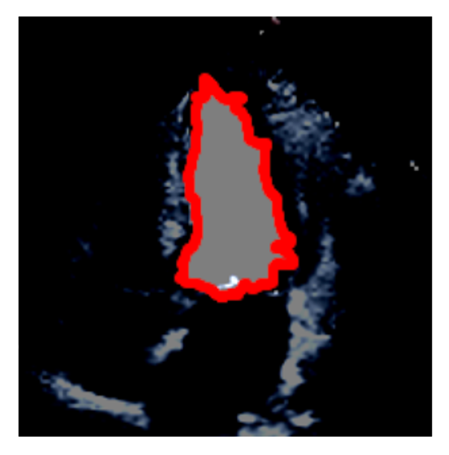

---------------

<p align="center">
  
</p>

<h1 align="center">
    <b> ETAB Benchmark Suite and Model Zoo </b>
</h1>

The ETAB benchmark suite encapsulates a diverse set of tasks that are meant to test the quality of visual representations of echocardiograms with respect to different downstream setups of interest across different datasets. The benchmark tasks fall in four different catgeories: 🔴 *cardiac structure identification* tasks where the goal is to automatically identify anatomical regions of interest, 🔵 *cardiac function estimation* tasks where the goal is to evaluate cardiac hemodynamics and left ventricle measurements, 🟢 *view recognition tasks* where the goal is to automate view annotations for echocardiography clips, and 🟡 *clinical prediction tasks* where the goal is to predict clinical outcomes or issue diagnoses based on observed echocardiograms. Combinations of these tasks constitute adaptation benchmarks that can be used to evaluate transferrability of features across views, data sets and annotations. In this Section, we provide an overview of the ETAB benchmark suite and the supported built-in vision models, along with code snippets and demo notebooks illustrating how users can run a benchmark experiment out-of-the-box. 


## Benchmark task categorization and encoding

Each benchmark is encoded with a 5-character code that designates the source dataset, the echocardiography view and the downstream task. The structure of the benchmark code follows the layout below:
<div align="center">
<table border="1">
  <tr>
  <td colspan="3"> <div align="center"> <b> Benchmark code </b> <i>(5 characters)</i> </div> </td>
 </tr>
 <tr>
  <td> <i> <div align="center"> Task code (2 characters)    </div> </i> </td>
  <td> <i> <div align="center"> View code (2 characters)    </div> </i> </td>
  <td> <i> <div align="center"> Dataset code (1 character)  </div> </i> </td>
 </tr>
</table>
</div>

The 1-character dataset code can be interpreted using the following table:
<div align="center">
<table border="1">
  <tr>
  <td colspan="4"> <div align="center"> <b> Dataset code </b> </div> </td>
 </tr>
 <tr>
  <td> <i> <div align="center"> EchoNet  </div> </i> </td>
  <td>     <div align="center"> E               </i> </td>
  <td> <i> <div align="center"> CAMUS    </div> </i>   </td>
  <td>     <div align="center"> C               </i> </td> 
 </tr>
 <tr>
  <td> <i> <div align="center"> TMED   </div> </i> </td>
  <td>     <div align="center"> T             </i> </td>
  <td> <i> <div align="center"> Unity  </div> </i> </td>
  <td>     <div align="center"> U             </i> </td>
 </tr> 
</table>
</div>
The echocardiographic views are encoded as follows:
<div align="center">
<table border="1">
  <tr>
  <td colspan="4"> <div align="center"> <b> View code </b> </div> </td>
 </tr>
 <tr>
  <td> <i> <div align="center"> An  </div> </i> </td>
  <td>     <div align="center"> Apical n-chamber  </i> </td>
 </tr>
 <tr>
  <td> <i> <div align="center"> PL  </div>          </i> </td>
  <td>     <div align="center"> Parasternal long axis </i> </td>
 </tr>
 <tr>
  <td> <i> <div align="center"> PS  </div>          </i> </td>
  <td>     <div align="center"> Parasternal short axi </i> </td>
 </tr> 

</table>
</div>

Currently, ETAB includes 9 core tasks across the 4 task categories. The list of all tasks and their corresponding 2-character codes are summarized in the table below. Tasks with strikethrough marks are still under implementation and will be included in the next release. 
<div align="center">
<table border="1">
 <tr>
  <td>&nbsp; <b> <div align="center"> Task code        </div> </b> &nbsp;</td>
  <td>&nbsp; <b> <div align="center"> Description      </div> </b> &nbsp;</td>
  <td>&nbsp; <b> <div align="center"> Datasets (Views) </div> </b> &nbsp;</td>
 </tr>
 <tr>
  <td colspan="3"> 🔴 &nbsp; <i> Cardiac Structure Identification Tasks </i> <b> (Category: a) </b> </td>
 </tr>
 <tr>
  <td><b> 0 </b></td>
  <td>Segmenting the left ventricle (LV)</td>
  <td>EchoNet (AP4CH), CAMUS (AP2CH and AP4CH)</td>
 </tr>
 <tr>
 <td><b> 1 </b></td>
  <td>Segmenting the left atrium (LA)</td>
  <td>CAMUS (AP2CH and AP4CH)</td>
 </tr> 
 <tr>
 <td><b> 2 </b></td>
  <td>Segmenting the myocardial wall (MY)</td>
  <td>CAMUS (AP2CH and AP4CH)</td>
 </tr>  
 <tr>
 <td colspan="3"> 🔵 &nbsp; <i> Cardiac Function Estimation Tasks </i> <b> (Category: b) </b> </td>
 </tr>
 <tr>
  <td><b> 0 </b></td>
  <td>Estimating LV ejection fraction</td>
  <td>EchoNet (AP4CH), CAMUS (AP2CH and AP4CH)</td>
 </tr>
  <tr>
  <td><b> 1 </b></td>
  <td>Classifying end-systole and end-diastole frames</td>
  <td>EchoNet (AP4CH), CAMUS (AP2CH and AP4CH)</td>
 </tr> 
  <tr>
  <td><b> 2 </b></td>
  <td><s>Longitudinal strain estimation</s></td>
    <td><s>Unity</s> (AP4CH)</td>
 </tr>
 <tr>
  <td><b> 3 </b></td>
  <td><s>Interventricular septum thickness estimation</s></td>
    <td><s>Unity</s> (PLAX)</td>
 </tr> 
 <tr>
  <td><b> 4 </b></td>
  <td><s>Posterior wall thickness estimation</s></td>
    <td><s>Unity</s> (PLAX)</td>
 </tr>  
 <tr>
 <td colspan="3"> 🟢 &nbsp; <i> View Recognition Tasks </i> <b> (Category: c) </b> </td>
 </tr>
 <tr>
  <td><b> 0 </b></td>
  <td>Classifying apical 2- and 4-chamber views</td>
  <td>CAMUS (AP2CH vs. AP4CH)</td>
 </tr>
  <tr>
  <td><b> 1 </b></td>
  <td>Classifying parasternal short and long axis views</td>
  <td>TMED (PLAX vs. PSAX)</td>
 </tr> 
 <tr>
  <td><b> 2 </b></td>
  <td><s>Classifying all apical and parasternal views</s></td>
  <td><s>Unity</s> (AP2CH vs. AP3CH vs. AP4CH vs. AP5CH vs. PLAX vs. PSAX)</td>
 </tr>  
 <tr>
 <td colspan="3"> 🟡 &nbsp; <i> Clinical Prediction Tasks </i> <b> (Category: d) </b> </td>
 </tr>
 <tr>
  <td><b> 0 </b></td>
  <td>Diagnose cardiomyopathy</td>
  <td>EchoNet (AP4CH), CAMUS (AP2CH and AP4CH)</td>
 </tr>
  <tr>
  <td><b> 1 </b></td>
  <td>Diagnose aortic stenosis</td>
  <td>TMED (PSAX and PLAX)</td>
 </tr> 
</table>
</div>
The benchmark codes are represented as strings with characters encoding the dataset, view and task as described above. To provide an example on how to interpret the benchmark code, consider the following string-valued variable:

```
benchmark_code = "a0-A4-E"
```

This code designates the benchmark task of segmenting the LV using apical 4-chamber echoes sampled from the EchoNet dataset.

## ETAB model zoo

The ETAB library provides a unified API for training a number of baseline models on all the benchmark tasks listed above. Each baseline model comprises a backbone representation and a task-specific head as illustrated below.

<p align="center"> 
   
</p>

The backbone representation is a general-purpose representation of echocardiographic images (or clips) that is independent of the task, whereas the head changes based on the task. The backbone representations supported in ETAB fall into two categories: convolutional neural networks and vision transformers. The list of all backbone representations in ETAB are listed below.   

<div align="center">
<table border="1">
 <tr>
  <td colspan="2"> <div align="center"> <i> Available backbones </i> </div> </td>
  <td> <div> <i> Reference </i> </div> </td>
 </tr> 
 <tr>
  <td rowspan="6"><b> Convolutional Neural Networks (CNN) </b></td>
  <td>ResNet </td>
  <td> <div align="center"> <a href="https://arxiv.org/abs/1512.03385">[1]</a> </div> </td>
 </tr>
  <tr>
  <td>ResNeXt</td> 
  <td> <div align="center"> <a href="https://openaccess.thecvf.com/content_cvpr_2017/papers/Xie_Aggregated_Residual_Transformations_CVPR_2017_paper.pdf">[2]</a> </div> </td>
 </tr>
  <tr>
  <td>DenseNet</td> 
  <td> <div align="center"> <a href="https://arxiv.org/pdf/1404.1869.pdf">[3]</a> </div> </td>
 </tr>  
 <tr>
  <td>Inception</td>
  <td> <div align="center"> <a href="https://www.cv-foundation.org/openaccess/content_cvpr_2016/papers/Szegedy_Rethinking_the_Inception_CVPR_2016_paper.pdf">[4]</a> </div> </td>
 </tr>  
 <tr>
  <td>MobileNet</td>
  <td> <div align="center"> <a href="https://arxiv.org/abs/1905.02244">[5]</a> </div> </td>
 </tr>  
 <td>ConvNeXt</td>
  <td> <div align="center"> <a href="https://arxiv.org/abs/2201.03545">[6]</a> </div> </td>
 </tr>
 
  <tr>
  <td rowspan="6"><b> Vision Transformers (ViT) </b></td>
  <td>Mix Transformer encoders (MiT) </td> 
  <td> <div align="center"> <a href="https://arxiv.org/pdf/2105.15203v2.pdf">[7]</a> </div> </td>
 </tr>
  <tr>
  <td>Pyramid Vision Transformer (PVT)</td> 
  <td> <div align="center"> <a href="https://arxiv.org/abs/2106.13797">[8]</a> </div> </td>
 </tr>
  <tr> 
  <td>Multi-scale vision Transformer (ResT)</td>  
  <td> <div align="center"> <a href="https://arxiv.org/abs/2105.13677v3">[9]</a> </div> </td>
 </tr>  
 <tr>
  <td>PoolFormer</td>
  <td> <div align="center"> <a href="https://arxiv.org/abs/2111.11418">[10]</a> </div> </td>
 </tr>  
 <tr>
  <td>UniFormer</td>
  <td> <div align="center"> <a href="https://arxiv.org/abs/2201.09450">[11]</a> </div> </td>
 </tr>  
 <td>Dual Attention Vision Transformers (DaViT)</td>
  <td> <div align="center"> <a href="https://arxiv.org/abs/2204.03645">[12]</a> </div> </td>
 </tr>
 
</table>
</div>

The set of all available task-specific heads (for classification, regression and segmentation tasks) are listed below.

<div align="center">
<table border="1">
 <tr>
  <td colspan="2"> <div align="center"> <i> Available task-specific heads </i> </div> </td>
  <td> <div> <i> Reference </i> </div> </td>
 </tr> 
 <tr>
  <td rowspan="1"><b> Classification and regression heads (still image) </b></td>
  <td>Standard linear probe </td>
  <td> <div align="center"> --- </div> </td>
 </tr>
 <tr>
  <td rowspan="2"><b> Classification and regression heads (video clips) </b></td>
  <td>RNN + Linear output layer </td>
  <td> <div align="center"> --- </div> </td>
 </tr> 
 <tr>
  <td>LSTM + Linear output layer </td> 
  <td> <div align="center"> --- </div> </td>
 </tr>

 <tr>
  <td rowspan="8"><b> Segmentation heads </b></td>
  <td>U-Net </td> 
  <td> <div align="center"> <a href="https://arxiv.org/abs/1505.04597">[13]</a> </div> </td>
 </tr> 
 <tr>
  <td>U-Net++ </td> 
  <td> <div align="center"> <a href="https://arxiv.org/pdf/1807.10165.pdf">[14]</a> </div> </td>
 </tr> 
 <tr>
 <td>MAnet </td> 
  <td> <div align="center"> <a href="https://ieeexplore.ieee.org/abstract/document/9201310">[15]</a> </div> </td>
 </tr> 
 <tr>
 <td>Linknet </td> 
  <td> <div align="center"> <a href="https://arxiv.org/abs/1707.03718">[16]</a> </div> </td>
 </tr>   
 <tr>
 <td>PSPNet </td> 
  <td> <div align="center"> <a href="https://arxiv.org/abs/1612.01105">[17]</a> </div> </td>
 </tr> 
 <tr>
 <td>DeepLabV3 </td> 
  <td> <div align="center"> <a href="https://arxiv.org/abs/1706.05587">[18]</a> </div> </td>
 </tr> 
 <tr>
 <td>SegFormer </td> 
  <td> <div align="center"> <a href="https://arxiv.org/abs/2105.15203v2">[19]</a> </div> </td>
 </tr>  
 <tr>
 <td>TopFormer </td> 
  <td> <div align="center"> <a href="https://arxiv.org/abs/2204.05525">[20]</a> </div> </td>
 </tr> 
</table>
</div>

To display all available baseline models, you can print the output of the *available_backbones()* and *available_heads()* functions in the *etab.baselines.models* modules as follows.  

```
from etab.baselines.models import *

print(available_backbones())
print(available_heads())
```

### Video data vs. Still images

Note that some benchmark tasks (e.g., estimation of LV ejection fraction) are defined with respect to video clips rather than still images, whereas other tasks and datasets are limited to 2D images. In the current release of ETAB, we restrict the backbone representations to frame embeddings and use these representations repeatedly over sequences of images and defer the modeling of the temporal correlations between these embeddings to the head through variants of RNNs. By limiting the backbone representations to frame embeddings, we can evaluate the quality of a backbone representation by tuning the attached task-specific heads across all benchmark tasks above to obtain the ETAB score as we discuss in the next Section.

## Running a benchmark experiment out-of-the-box (**[demo notebook](https://github.com/ahmedmalaa/ETAB/blob/main/notebooks/Demo%201%20-%20ETAB%20Data%20Loading%20and%20Processing%20Tools.ipynb)**)

In what follows, we describe how users can run a benchmark experiments out-of-the-box using the ETAB API. Next, we will show how an experiment can be ran from the terminal using our built-in scripts.

### Composing a model and training on a benchmark task

The first step in running a benchmark experiment is to load the relevant dataset. Consider again the benchmark task "a0-A4-E". This task involves segmenting the LV using apical 4-chamber views from the EchoNet dataset. The dataset can be loaded as follows: 

```
from etab.datasets import ETAB_dataset

echonet = ETAB_dataset(name="echonet",
                       target="LV_seg", 
                       view="A4",
                       video=False,
                       normalize=True,
                       frame_l=224,
                       frame_w=224,
                       clip_l=1)

echonet.load_data(n_clips=7000)

train_loader, valid_loader, test_loader = training_data_split(echonet.data, train_frac=0.6, val_frac=0.1)                
```

We have covered the data loading and processing tools in the previous section. More details can be found in this **[demo notebook](https://github.com/ahmedmalaa/ETAB/blob/main/notebooks/Demo%201%20-%20ETAB%20Data%20Loading%20and%20Processing%20Tools.ipynb)**. The next step is to compose a baseline model by creating an instance of the *ETABmodel* class as follows.

```
from etab.baselines.models import ETABmodel

model  = ETABmodel(task="segmentation",
                   backbone="ResNet-50",
                   head="U-Net")
```

The *model.backbone* and *model.head* are both torch model classes, the hyper-parameters of which can be altered by modifying the values of the attributes of *model.backbone* and *model.head* after instantiating the model. Here, we instantiate a standard segmentation model with a ResNet-50 backbone and a U-Net head, but the user can create alternative models using the options specified in the table above. Now, to start training the instantiated model on task "a0-A4-E", we need to set the optimizer and training parameters as follows:

```
batch_size    = 32
learning_rate = 0.001
n_epoch       = 100
ckpt_dir      = "/directory for saving the trained model"
```
We can then train the model by invoking the *.train* method in the *ETABmodel* class after passing the training and validation loaders along with the optimization and training parameters.

```
model.train(train_loader, 
            valid_loader, 
            n_epoch=n_epoch,
            learning_rate=learning_rate,
            ckpt_dir=ckpt_dir)
```

After the model is trained, we can inspect its predictions on samples from test data as follows: 

```
inputs, ground_truths = next(iter(test_loader))
preds                 = model.predict(inputs.cuda())

plot_segment(torch.tensor(inputs[index, :, :, :]), 
             torch.tensor(preds[index, :, :]), 
             overlay=True, color="r")
```

<p> 
   
</p>

### Evaluating a model on test data

To evaluate the performance of the model on the testing sample, you can use the *evaluate_model* function in *etab.utils.metrics* as follows:

```
from etab.utils.metrics import *

dice_coeff = evaluate_model(model, test_loader, task_code="a0")

```

By passing the task code to this general-purpose evaluation function, it automatically selects the corresponding evaluation metric for the task. Because this is a segmentation task, the output is a Jaccard Index/Dice coefficient. The function computes the AUC-ROC for classification tasks and the mean square error for regression tasks.


### Freezing the backbone and tuning the head

In the example above, we have trained a model by fully optimizing all its parameters for the task at hand. In many cases, we might be interested in only tuning the task-specific head and keeping the backbone representation frozen. We can do so by enabling the *freeze_backbone* flag in the model instantiation command as follows:

```
model  = ETABmodel(task="segmentation",
                   backbone="ResNet-50",
                   head="U-Net",
                   freeze_backbone=True)
```

As we will show in the next Section, when computing the ETAB score we are interested in evaluating a pre-trained representation, hence we freeze the backbone model for all benchmark tasks and only tune the head and evaluate the pefromance of the model on test data.

To run the above experiments your self, please refer to the following **[demo notebook](https://github.com/ahmedmalaa/ETAB/blob/main/notebooks/Demo%201%20-%20ETAB%20Data%20Loading%20and%20Processing%20Tools.ipynb)**. 

### CLI for running a benchmark experiment from terminal

You can also run any benchmark task directly from the terminal using the following command:

```
$ python run_benchmark.py --task "a0-A4-E" --backbone "ResNet-50" --head "U-Net" --freeze_backbone False \
                          --train_frac 0.6 --val_frac 0.1 --lr 0.001 --epochs 100 --batch 32  
```

To run a task adaptation benchmark, where the backbone representation is trained on a source task and then tuned on a target task, you can use the following command:

```
$ python run_benchmark.py --source_task "a0-A4-E" --target_task "a1-A2-C" --backbone "ResNet-50" --head "U-Net" \
                          --freeze_backbone False --train_frac 0.6 --val_frac 0.1 --lr 0.001 --epochs 100 --batch 32  
```

In the example above, the experiment will proceed by training a model to segment the LV using AP4CH views in EchoNet data, and then tune the resulting model to segment the LA using A2CH views in CAMUS dataset. 


## References and acknowledgments

Our model API builds on the implementations of following libraries: 

[1] https://poutyne.org/ 

[2] https://github.com/sithu31296/semantic-segmentation

[3] https://github.com/qubvel/segmentation_models.pytorch 

[4] https://github.com/rwightman/pytorch-image-models


