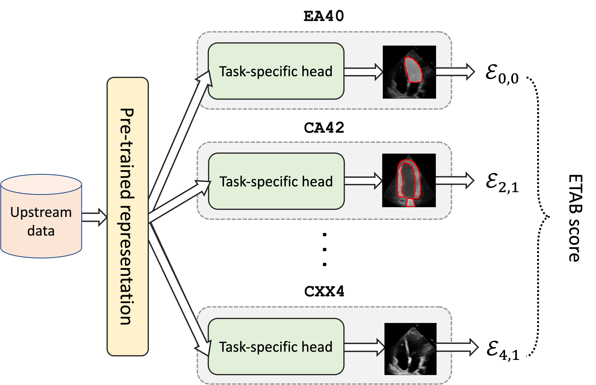

---------------

  

<h1 align="center">
    <b> The ETAB Evaluation Protocol </b>
</h1>

In many cases, we might be interested in evaluating a visual representation pre-trained on an external data set with respect to their ability to capture all relevant features in echocardiograms. These pre-trained representations might have been trained on private echocardiogram data, data for other cardiac imaging modalities, or even a general visual representation pre-trained on non-medical data such as ImageNet. The ETAB evaluation protocol uses the suite of benchmark tasks listed in the previous Section to evaluate the usefulness of any given (pre-trained) visual representation for a wide variety of common tasks in echocardiography. In this Section, we describe the ETAB evaluation protocol and provide code snippets illustrating how the user can compute the "ETAB score" for a pre-trained backbone representation.

## Description of the evaluation protocol

The evaluation protocol is meant to assess how well does a given pre-trained backbone representation perform on the ETAB benchmark tasks. Here, we freeze the backbone representation and only tune the task-specific head for each individual task. The output of the process is an *ETAB score*, which is a number in [0,1] that quantifies the quality of the pre-trained representation. A schematic depiction of the protocol along with a mathematical description are given below.

  

Let $\mathcal{K} = \{1, \ldots, K\}$ be the target task categories, and let $\mathcal{T}\_k = \{t\_{1,k}, \ldots, t\_{T\_k,k}\}$ be the tasks within category $k \in \mathcal{K}$. Let $\mathcal{D}\_{t, k}$ be the target data set associated with the $t$-th task within the $k$-th category. A given adaptation model $\mathcal{M}$ is provided with $n$ samples of the target data set $\mathcal{D}^n\_{t, k} = \{(X^i\_{t, k}, Y^i\_{t, k})\}^n\_{i=1}$, and outputs an adapted target model $\mathcal{M}(\mathcal{D}^n\_{t, k})$. Let $\mathcal{E}\_{t,k}$ be the evaluation metric used to assess the performance of the target model; we assume that $\mathcal{E}\_{t,k}$ takes on values in $[0,1]$.

## Computing the ETAB score
